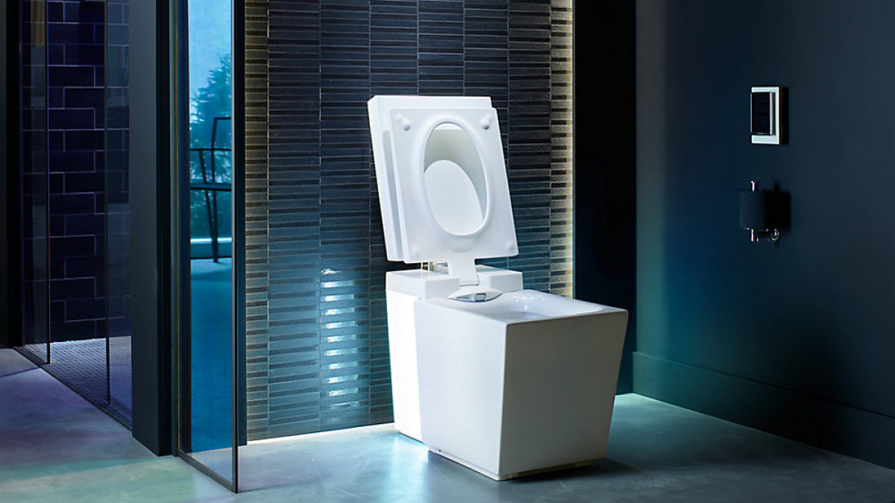

# Kohler Numi® 2.0

  

## Descripció

El Kohler Numi® 2.0 és un vàter intel·ligent que s'integra a la llar connectada. Aquest vàter exclusiu té tantes funcions que necessites el mòbil per configurar-lo.

## Característiques

- **Il·luminació ambiental**: El Numi 2.0 integra un sistema d'il·luminació ambiental.
- **Altaveus integrats**: Compta amb altaveus integrats.
- **Seient amb calefacció**: El seient té calefacció amb obertura i tancament lliures de mans.
- **Mode d'estalvi d'energia**: Inclou el mode d'estalvi d'energia per a l'eficiència energètica.
- **Descàrrega d'emergència**: Admet fins a 100 descàrregues durant un tall d'energia amb una simple activació amb un botó tàctil[1].
- **Funció d'autoneteja**: Utilitza llum ultraviolada i sistemes d'aigua electrolitzada per netejar automàticament les superfícies de la vareta.
- **Sistema de secat per aire calent i desodorització automàtica**.

## Control

La integració a la llar connectada és possible gràcies a un control remot que serveix com a complement a l'aplicació KOHLER Konnect, que es pot instal·lar al mòbil per a un control avançat.

## Preu i disponibilitat

El vàter connectat Numi 2.0 ja apareix a la web del fabricant, però això sí, tenir un aparell així no està a l'abast de tots, doncs per instal·lar-lo el preu no baixarà dels 8.200 dòlars.

## Referències

Kohler Numi 2.0: preu, característiques i fitxa tècnica