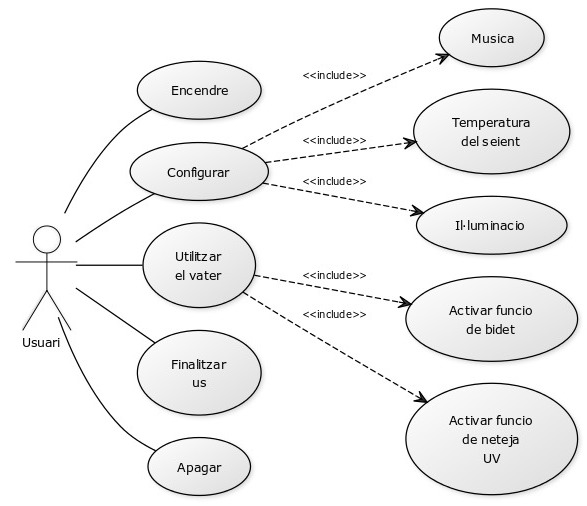
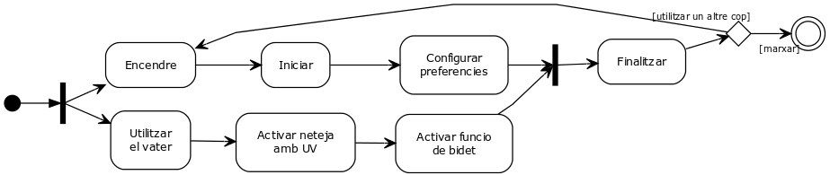
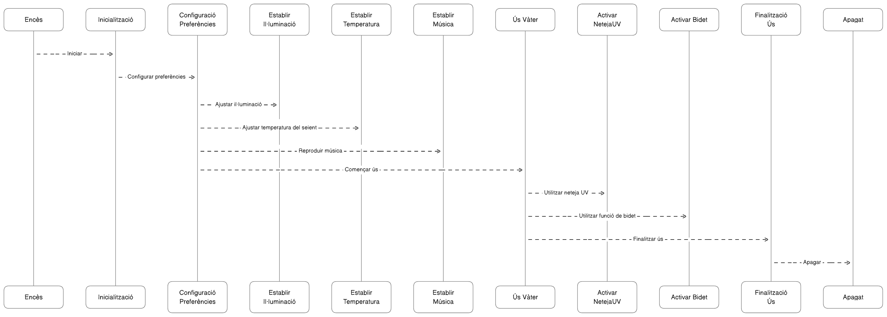

# Benvingut al futur del confort: Kohler Numi® 2.0

<div align="center">
  <a href="http://www.youtube.com/watch?v=vfuOqt70w54" target="_blank">
    
  </a>
</div>

## Un vàter intel·ligent per a una llar connectada

El Kohler Numi® 2.0 no és només un vàter, és una experiència de luxe que redefineix el confort al teu bany. Amb el seu disseny exclusiu i les seves funcionalitats avançades, el Numi® 2.0 t'ofereix un control total a través del teu mòbil.

## Característiques que t'encantaran

- **Il·luminació ambiental**: Personalitza el teu ambient amb el sistema d'il·luminació integrat.
- **Altaveus integrats**: Gaudeix de la teva música preferida amb els altaveus incorporats.
- **Seient amb calefacció**: Experimenta el màxim confort amb el seient calefactat.
- **Mode d'estalvi d'energia**: Estalvia energia amb el mode d'eficiència energètica.
- **Descàrrega d'emergència**: Prepara't per a qualsevol eventualitat amb fins a 100 descàrregues durant un tall d'energia.
- **Funció d'autoneteja**: Mantén el teu vàter impecable amb la funció d'autoneteja que utilitza llum ultraviolada i sistemes d'aigua electrolitzada.
- **Sistema de sec per aire calent i desodorització automàtica**: Gaudeix d'un secat suau i una desodorització automàtica després de cada ús.

## Control total a les teves mans

Controla totes les funcions del Numi® 2.0 amb el control remot o a través de l'aplicació KOHLER Konnect al teu mòbil.

## ¿A punt per al luxe?

El vàter connectat Numi 2.0 ja està disponible a la web del fabricant. Prepara't per a una experiència de luxe al teu bany per només 8.200 dòlars.

## Més informació

Per a més detalls sobre el preu, les característiques i la fitxa tècnica del Kohler Numi 2.0, visita l'article a la [web oficial de Kohler](https://www.kohler.com/en/products/toilets/shop-toilets/numi-2-0-one-piece-elongated-smart-toilet-dual-flush-30754-pa)

## Diagrames:

### Cas d'ús

<div align="center">
  
</div>

```
Els casos d'ús inclouen Encendre el vàter, Configurar diferents preferències com Il·luminacio, Temperatura del seient i Musica.

Un cop configurat, l’Usuari pot Utilitzar el vater, durant el qual pot Activar funcio de neteja UV i Activar funcio de bidet.

Després de l’ús, l’Usuari pot Finalitzar us i finalment Apagar el vàter.
```

### D'activitat

<div align="center">
  
</div>

```
En el primer flux, el vàter s’encén, s’inicia i es configuren les preferències.

En el segon flux, es comença a utilitzar el vàter, s’activa la funció de neteja UV i la funció de bidet.

Després d’aquests fluxos, els camins es reuneixen en la línea vertical en negrta, i el vàter finalitza l’ús i s’apaga, la qual cosa porta al final del diagrama.
```

### D'estats

<div align="center">
  
</div>

```
El diagrama comença amb l’estat inicial, que es mou a l’estat Encès quan s’encén el vàter. 

Després passa a l’estat Inicialització i després a Configuració Preferències, on es poden ajustar diferents preferències com Il·luminació, Temperatura del seient i Música. 

Un cop configurades les preferències, es passa a l’estat Ús Vàter, on es poden activar funcions com Neteja UV i Bidet. 

Després de l’ús, es passa a l’estat Finalitzar i finalment a Apagat quan s’apaga el vàter.
```